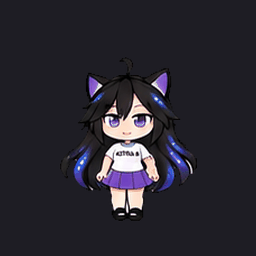

# Astra Codex Pet

A custom animated Codex companion with purple cat ears, starry black hair, and an ASTRA 6 shirt.



## Install on Windows

Requires Codex desktop with custom pet support and Windows PowerShell 5.1 or PowerShell 7. No administrator access, Python, or additional packages are needed.

Clone this private repository using your signed-in GitHub account:

```powershell
git clone https://github.com/clxcht/astra-codex-pet.git
cd astra-codex-pet
powershell -NoProfile -ExecutionPolicy Bypass -File .\install.ps1
```

You can also download the repository ZIP from GitHub, extract it, and run the same installer command from the extracted folder. The execution-policy option applies only to that PowerShell process.

Then select **Astra** in Codex's pet picker. Restart Codex if the new pet is not listed. If your version only offers uploads, import `pet/spritesheet.png` as a custom pet named Astra.

The installer uses `CODEX_HOME` when set, otherwise your user profile's `.codex` directory. To use a different location:

```powershell
.\install.ps1 -CodexHome 'D:\Codex Data'
```

Preview an installation without writing files:

```powershell
.\install.ps1 -WhatIf
```

The installer verifies the package's SHA-256 hashes, installs `pet.json` and `spritesheet.png` under `pets/astra`, and verifies the installed copies. Reinstalling identical files does nothing. If files differ, it backs up the previous files under `pet-backups` before replacing them. It preserves other pets and Codex settings; pet selection is done in the app because the running app can overwrite direct settings-file edits.

## Artwork

- Version 2 atlas: 1536 x 2288 pixels, transparent RGBA PNG.
- Grid: 8 columns x 11 rows, with 192 x 208 pixel cells.
- Animation rows: idle, run right, run left, wave, jump, frustrated, waiting, working, reviewing, and two rows of looking directions.
- 73 required frames populated; all 88 cells contain artwork.

The artwork was generated from the supplied character reference with the built-in image tool, then locally cleaned and aligned with permission. The generation notes are in `docs/generation-prompt.txt`.

## Test the installer

```powershell
powershell -NoProfile -ExecutionPolicy Bypass -File .\tests\install.Tests.ps1
```

Tests use a temporary Codex data directory and do not modify your actual installation.
